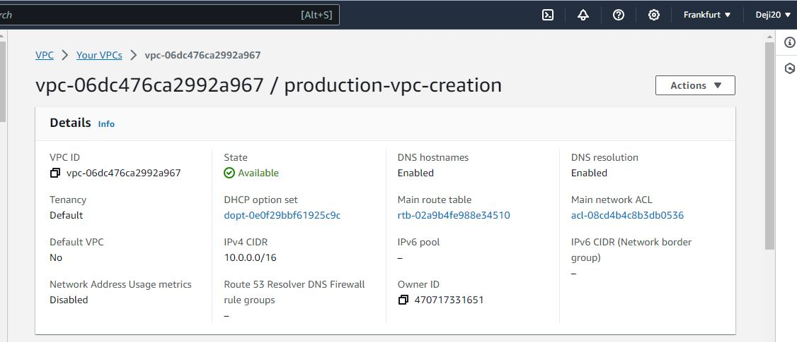
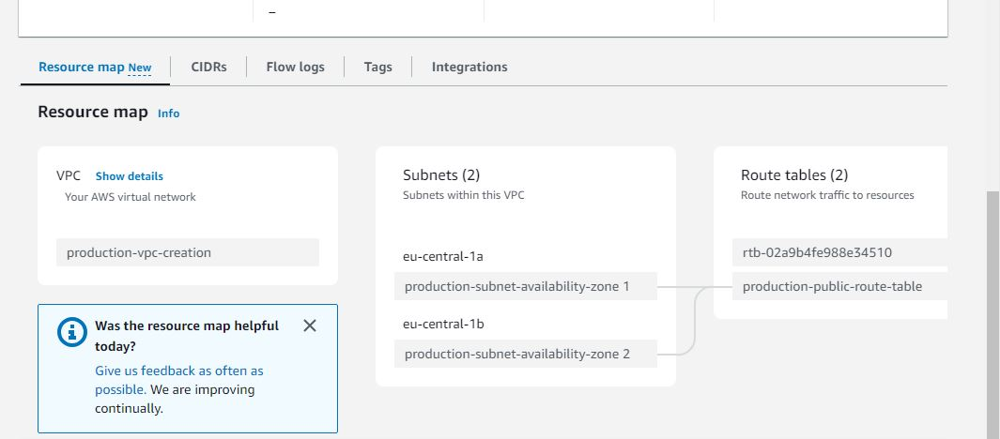
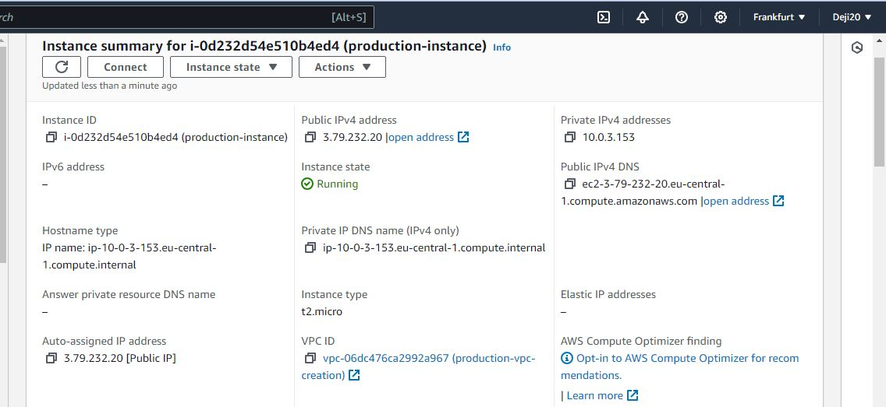
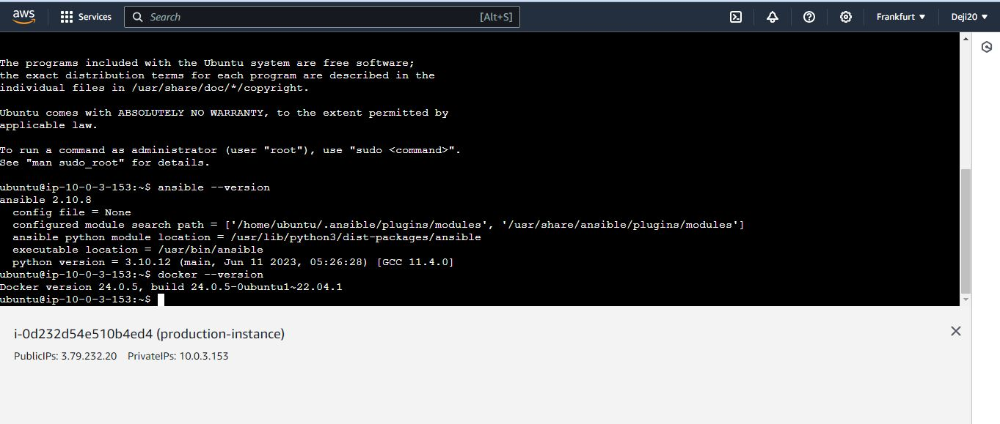
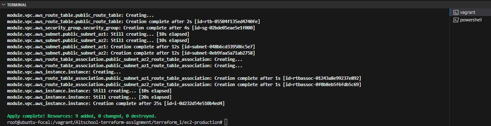

 # Project Name 
  Cloud Engineering Third Semester Assignment 1 :Create an aws instances(Ubuntu) using Terraformin multiple regions(free tier) on (eu-west-1 and eu-central-1)

  #Further Explanation
  It should be on a minimum of two availability zones
  It should be reusable
  It can be built on multiple environments(development and production)
  It should have a script that creates ansible,docker container
  The script should be modularized
  Also create a VPC for the various environments

  ## Description
 1. The project will use vagrant as the VM for deployment
 
 2. Terraform, Ansible and AWS CLI are all installed on the virtual machine .
 
 3. The directory containing the terraform files and the ansible script(Altschool-terraform-assignment) was moved to the VM by adding 
    config.vm.synced_folder "C:/Users/user/Desktop/semester_3_altschool/", "/vagrant_data"
    to the vagrantfile created before running vagrant up to acces the directory when cd into /vagrant.
 
 4. Directory explanation: 
    semester_3_altschool --> .vagrant directory , Altschool-terraform-assignment and the vagrantfile
    .vagrant directory contain the machines and rgloader directories
    Altschool-terraform-assignment directory contain terraform_1 directory which point to ec2-development directory , ec2-production directory and modules directory
    
    ec2-development: main.tf ,variable.tf ,region-1.tfvars
    ec2-production: main.tf ,variable.tf ,region-2.
    modules directory --> vpc directory
    vpc: ec2.tf , main.tf ,outputs.tf , sg.tf and variable.tf

 5. Inside the modules directory --> vpc directory --> ec2.tf file
    The ec2.tf contain a bash user_data that will install ansible and docker on the instances
    The script will do the following;
    Update the package lists on the system.
    Install Docker.
    Start and enable the Docker service.
    Install Ansible.

  ## Prerequisites
 
 1. VirtualBox
 
 2. Vagrant 
 
 3. Ubuntu os
 
 4. Bash (user_data)
    Install Ansible and Docker on the instance
 
 5. aws configure: This should be done via the terminal
    AWS Access Key ID:
    AWS Secret Access Key:
    Default region name:
    Default output format:
 
 6. aws IAM user account

 7. Terraform

 8. Vagrantfile

  ## Modules
     This directory cotain a directory called vpc
     which is used as a module in the main.tf,ec2.tf ,outputs.tf,sg.tf and variable.tf.
     Main.tf file shows the creation of vpc,create internet gateway and attach it to the vpc.
     shows how to use data source to get all avalablility zones in regions.
     Create public subnet for availability zone 1 and 2
     Create route table and add public route
     Associate public subnet availability zone 1 and 2 to "public route table"

     ec2.tf
     Shows the modular resource that create the instance alongside the user data file that
     install ansible and docker on the instance

     outputs.tf
     Shows the output and value for the region ,project_name, vpc_id,
     internet_gateway and the public_ip.

     Variable.tf
     This declare all the necessary variables used in this terraform project

  ## ec2-development
     This directory house the files required to run the terraform of the development environment
     it include the following files:
     main.tf: contain and explain the terraform required_providers,
     provider "aws" with its region and variable value.
     it also shows the module "vpc" which include the source ,region ,project_name,vpc_cidr,
     public_subnet_az1_cidr , public_subnet_az2_cidr ,ami ,type and key_pair with all there assigned value.

     region-1.tfvars: This is used to store all the variable values that is required 
     to run terraform apply of this particular directory.

     Variable.tf: This declare all the necessary variables used in this terraform project
     
     To run the terraform:

      cd into semester_3_altschool(this directory consist of the Altschool-terraform-assignment and the vagrantfile) ,run vagrant up,then vagrant ssh
     in the linux environment run sudo su to gain the root user priviledges.
     
     cd into /vagrant , cd into Altschool-terraform-assignment , cd into terraform_1 then cd into ec2-development from the terminal
     
     terraform plan -var-file=region-1.tfvars
     This will show a planned output for what Terraform will do if you were to apply
     
     terraform apply -var-file=region-1.tfvars
     This will actually start creating the infrastructure.

     terraform destroy -var-file=region-1.tfvars --auto-approve
     This will delete everything created by the previous command and safe the user from accruing high cost on aws

     ## ec2-production
     This directory house the files required to run the terraform of the development environment
     it include the following files:
     main.tf: contain and explain the terraform required_providers,
     provider "aws" with its region and variable value.
     it also shows the module "vpc" which include the source ,region ,project_name,vpc_cidr,
     public_subnet_az1_cidr , public_subnet_az2_cidr ,ami ,type and key_pair with all there assigned value.

     region-1.tfvars: This is used to store all the variable values that is required 
     to run terraform apply of this particular directory.

     Variable.tf: This declare all the necessary variables used in this terraform project
     
     To run the terraform:
     cd into semester_3_altschool(this directory consist of the Altschool-terraform-assignment and the vagrantfile) ,run vagrant up,then vagrant ssh
     in the linux environment run sudo su to gain the root user priviledges.
     
     cd into /vagrant , cd into Altschool-terraform-assignment , cd into terraform_1 then cd into ec2-production from the terminal

     terraform init:this will create the .tfstate ,.terraform and .terraform.lock.hcl
     
     terraform plan -var-file=region-2.tfvars
     This will show a planned output for what Terraform will do if you were to apply
     
     terraform apply -var-file=region-2.tfvars
     This will actually start creating the infrastructure.

     terraform destroy -var-file=region-2.tfvars --auto-approve
     This will delete everything created by the previous command and safe the user from accruing high cost on aws

      
 4.  files : Screen shots evidence
    
     Development:
       
       

       
      
       
      
       
      
       
     
      Production:
       
       
     
       

       
      
       

       
      
      
      ## Contact

      tajudeenadedejir2@gmail.com

      ## Acknowledgments
      
      Instructors and Colleagues at AltSchool Africa
      
      https://www.google.com/
      
      https://aws.amazon.com/free/

      https://www.terraform.io/

      https://github.com/hashicorp/vagrant

      https://askubuntu.com/questions/85627/how-to-display-a-picture-in-html

      https://chat.openai.com

      

